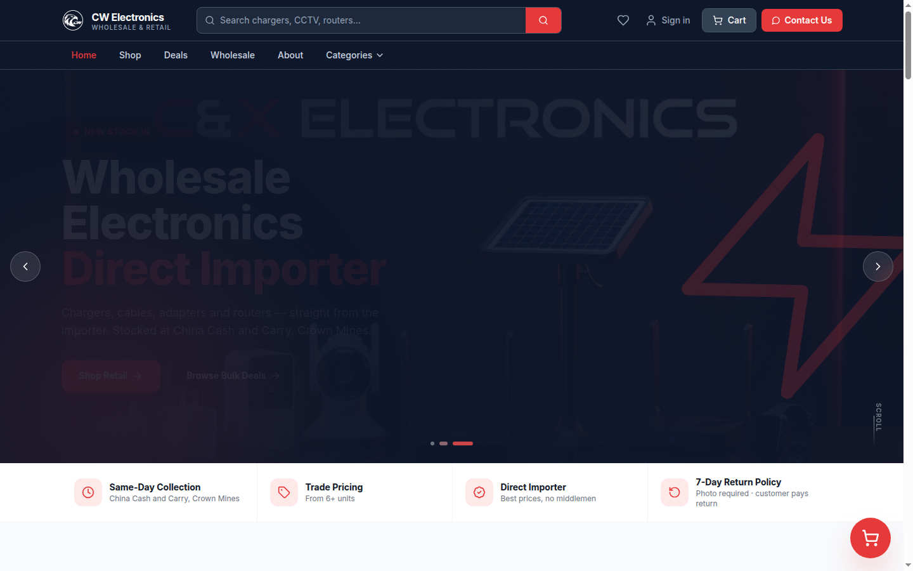
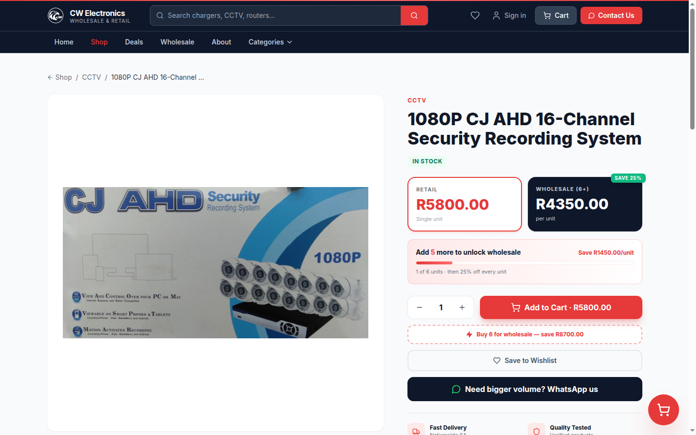
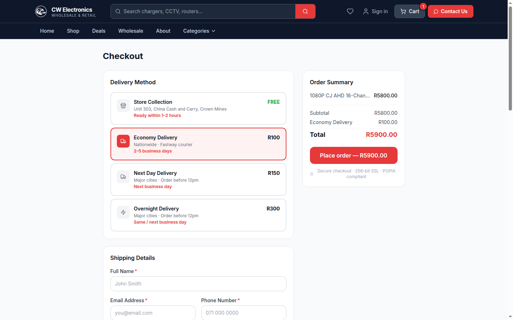
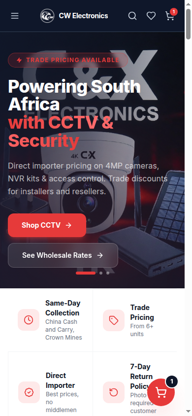

# CW Electronics — E-commerce Storefront & Admin Platform

A production e-commerce web application for a South African consumer-electronics
importer: a public storefront with retail and wholesale pricing, customer accounts
and order tracking, and a bilingual admin panel for catalogue, order and customer
management. Built with React, TypeScript and Supabase; deployed as a static SPA.

**Live site:** https://cw-electronics.co.za

---

## Overview

CW Electronics is a direct importer and wholesaler of consumer electronics based in
Johannesburg — CCTV and NVR kits, networking hardware, chargers and cables, solar
lighting, wearables and accessories. They sell to three overlapping audiences from
one showroom: walk-in retail customers, installers and resellers buying in bulk, and
small businesses.

I built and maintain this platform for them. It serves all three audiences from a
single codebase and a single Postgres database, and is operated day-to-day by a small
non-technical team alongside the physical showroom.

---

## The problem

Selling to retail walk-ins, resellers and small businesses out of one showroom
creates four requirements that a generic storefront template does not meet:

1. **Two prices for one catalogue.** Resellers buy above a minimum quantity at a
   discount; retail customers do not. Maintaining two separate product lists would
   guarantee they drift apart.
2. **Orders must be traceable without a payment gateway.** The merchant account was
   still being verified, so the system had to issue real order numbers, take orders
   from guests, and track fulfilment through to collection or delivery on a manual
   EFT flow.
3. **Trading hours are short.** The showroom is open 09:00–15:00. Enquiries and
   orders outside that window had to be captured and acknowledged automatically.
4. **The back office had to be bilingual.** Staff operate in both English and
   Chinese, so every admin label needed to switch without affecting the public site.

---

## The solution

A single React SPA backed by Supabase, split into three surfaces:

- **Storefront** — indexable catalogue with per-product pages, category landing
  pages, a buying-guide blog, search, and a cart/checkout that issues real order
  numbers and emails a receipt.
- **Wholesale view** — the same catalogue re-priced at a deterministic bulk
  discount above a 6-unit minimum, so reseller pricing is consistent and public.
- **Admin panel** — catalogue CRUD with image upload, an order pipeline with a
  status audit trail, customer records, a contact-message inbox, and a revenue
  dashboard. Every label is available in English and Chinese behind a toggle.

Order creation runs through a single `SECURITY DEFINER` Postgres function so guests
and logged-in customers share one trusted, atomic write path, and row-level security
can stay closed by default.

---

## Key features

**Storefront**
- Product catalogue with categories, variant groups, live autocomplete search,
  pagination and filtering
- Separate retail and wholesale pricing views (6-unit minimum, deterministic
  hash-seeded 15–25% bulk discount, overridable per product)
- Cart with persistence, slide-in drawer, upsells, and a mobile sticky add-to-cart bar
- Checkout with collection or three paid delivery tiers, address autocomplete, and
  EFT payment instructions
- Customer star reviews feeding a `Product` `aggregateRating`
- Indexable category landing pages and a buying-guide blog
- Installable PWA with a Workbox service worker and runtime caching
- Contact form persisted to the database and forwarded to an automation webhook

**Customer accounts**
- Registration, login, password reset
- Order history and per-order status tracking
- Wishlist

**Admin panel**
- Revenue and order dashboard (Recharts) with date-range filtering
- Product CRUD with direct-to-Cloudinary image upload and a bulk price-change tool
- Order pipeline with branch-aware status transitions and a full event audit trail
- Customer records searchable by name, email or phone
- Contact-message inbox with unread badge
- Printable retail and wholesale invoices and receipts
- English / 中文 interface toggle

---

## Tech stack

| Layer | Technology |
|---|---|
| Frontend | React 18, TypeScript, Vite 5 |
| Styling | Tailwind CSS 3 |
| Routing | react-router-dom v7 |
| Animation | Framer Motion |
| Charts | Recharts |
| Icons | Lucide React |
| Backend | Supabase — Postgres, Auth, Storage, Edge Functions |
| Auth | Supabase Auth (two isolated browser clients) |
| Images | Cloudinary (unsigned upload preset) |
| Automation / email | n8n webhooks |
| SEO | react-helmet-async, JSON-LD, build-time sitemap + product feed |
| PWA | vite-plugin-pwa (Workbox) |
| Hosting | Netlify (static SPA) |

---

## Architecture

```
React SPA (Netlify static hosting)
├── /                 public storefront      ── eager-loaded
├── /account/*        customer area          ── lazy-loaded
└── /admin/*          admin panel            ── lazy-loaded
                │
                ▼
        Supabase (Postgres)
        ├── Row-level security on every table
        ├── is_cw_admin()      — SECURITY DEFINER admin predicate
        └── place_order(jsonb) — SECURITY DEFINER atomic checkout
                │
                ▼
        n8n webhooks ──▶ transactional email
```

**Route-level code splitting.** The admin panel and customer account area are lazy
loaded and never enter the storefront bundle. High-traffic public routes stay eager.
Vendor chunks (`react`, `framer-motion`, `supabase`) are split via Rollup
`manualChunks` so app deploys do not invalidate them — this took the main chunk from
772 KB to 416 KB.

**Two Supabase clients, one auth schema.** The admin panel and the customer account
area use separate Supabase clients with separate `localStorage` keys against the same
project. Without this, a token refresh in one scope silently invalidated the session
in the other when both were open. Both sign out with `scope: 'local'` for the same reason.

**Security is enforced in Postgres, not the client.** Admin gating exists in four
client-side layers for user experience, but the actual boundary is a row-level
security predicate that checks the email claim on the JWT. A customer account that
bypassed every client check would still read nothing it does not own.

---

## Engineering highlights

**Atomic guest checkout via a `SECURITY DEFINER` RPC.** The original checkout wrote
to tables directly with `insert().select()`. Because RLS allows no anonymous `SELECT`,
the `select()` returned nothing for guests and every guest order failed *silently* —
zero orders reached the database. The fix was to make checkout call one Postgres
function that upserts the customer, creates the order, its line items and the first
status event in a single transaction, generates the sequential `CW-YYYY-NNNN` order
number server-side, and returns the created IDs. Guests and logged-in customers now
share one trusted write path, and the tables need no anonymous insert policy at all.

**Row-level security modelled around a JWT claim.** Rather than a roles table, admin
access is a `SECURITY DEFINER` predicate matching the email claim on the JWT. Customer
access is scoped by joining through `customers` on a case-insensitive email match, so
order items and status events inherit the parent order's ownership without duplicating
the rule.

**Build-time SEO asset generation.** A post-build Node script queries Supabase and
writes `dist/sitemap.xml` (every active product, category and static page) and
`dist/feed.xml` (a Google Shopping RSS 2.0 feed with the `g:` namespace, real brand,
GTIN and MPN). This runs at build time rather than as a serverless route because
Netlify serves on-disk files *before* applying the SPA rewrite — so both resolve with
no cold start and no per-request database load from crawlers. The generator is written
to never fail the build: if Supabase is unreachable it degrades to a static-only
sitemap and exits zero.

**Structured data.** `ElectronicsStore`, `FAQPage` and `BreadcrumbList` on the shell;
`Product` with `aggregateRating` built from real customer reviews; `BlogPosting` on
guide articles.

**Deterministic wholesale pricing.** Bulk discounts are derived from a hash of the
product ID rather than stored, so the same product always shows the same price across
renders and sessions without a migration — while a `bulk_price` column still overrides
it when a real negotiated price exists.

**Bilingual admin.** A dedicated admin-only language context with a typed translation
map, separate from the storefront language context and persisted independently, so the
public site stays English-only while the back office is fully bilingual.

**Payments designed to be swapped.** PayFast signing, redirect and a server-side ITN
verification edge function are implemented and dormant behind the current manual-EFT
flow while the merchant account is verified. Re-enabling is a one-line change at the
checkout call site because order creation is already a separate primitive.

---

## Screenshots

### Storefront home



### Product detail



### Checkout



### Mobile storefront



A wholesale-pricing capture is also in `docs/screenshots/`. Admin dashboard/order
screens aren't included here — they need an `is_cw_admin` login and weren't captured
to avoid an unauthenticated login attempt against production.

---

## Running locally

**Requirements:** Node.js 22+ (see `.nvmrc`) and npm. You will need your own Supabase
project; the application expects the schema described in `CLAUDE.md` section 6.

```bash
git clone <repository-url>
cd cw-electronics

npm install

cp .env.example .env.local
# Fill in .env.local with your own Supabase URL and anon key.
# .env.local is gitignored and must never be committed.

npm run dev          # http://localhost:5173
```

Only `VITE_SUPABASE_URL` and `VITE_SUPABASE_ANON_KEY` are required to boot. Every
other variable is optional and its feature degrades cleanly when unset — the n8n
webhooks, for example, are fire-and-forget and never block a user flow.

> **Note on `VITE_` variables:** Vite inlines every `VITE_`-prefixed variable into the
> public browser bundle. Only put values there that are safe for end users to read.
> Server-side secrets belong in Netlify environment variables or Supabase Edge
> Function secrets.

---

## Testing & quality

```bash
npm run typecheck    # tsc -b across both project references — strict mode
npm run lint         # ESLint 9 flat config, typescript-eslint + react-hooks
npm run build        # typecheck + production build + SEO asset generation
npm run preview      # serve the production build locally
```

TypeScript runs in `strict` mode with `noUnusedLocals`, `noUnusedParameters`,
`noFallthroughCasesInSwitch` and `noUncheckedSideEffectImports` enabled across the
whole codebase. The lint configuration does not disable rules to force a pass; the
`react-hooks/exhaustive-deps` findings that remain are reported as warnings so they
stay visible rather than being suppressed.

**There is currently no automated test suite.** This is the most significant gap in
the project. The intended first step is Vitest plus React Testing Library covering the
pure business logic — `src/lib/cart.ts`, `src/lib/wholesale.ts` and the order-status
transition map — followed by Playwright coverage of the checkout path.

---

## Deployment

Deployed to Netlify as a static SPA, built directly from the default branch.

- **Build:** `npm run build` → `dist/` (see `netlify.toml`)
- **Node version:** pinned to 22 via `.nvmrc`
- **SPA routing:** `/* → /index.html` at status 200, so client-side routes resolve on
  direct navigation and refresh
- **Assets:** precompressed to gzip and Brotli at build time
- **Environment:** all `VITE_*` variables are set in the Netlify dashboard, never in
  the repository
- **Edge function:** the PayFast ITN handler deploys separately to Supabase

`public/robots.txt` blocks `/admin`, `/checkout` and `/account` from indexing.

---

## What I built

I designed and built this application end to end as a solo developer, and continue to
maintain it in production for a paying client.

- **Product and data modelling** — the Postgres schema, its RLS policies, and the two
  `SECURITY DEFINER` helpers (`is_cw_admin`, `place_order`)
- **Full frontend** — all storefront, customer-account and admin routes; component
  library; cart, wishlist, language and auth contexts
- **Checkout and order pipeline** — cart maths, delivery tiers, order numbering, the
  branch-aware status state machine and its audit trail
- **Authentication** — the dual-client session split, the admin allow-list, and the
  server-side RLS boundary behind it
- **Integrations** — Supabase, Cloudinary uploads, n8n webhook automation, PayFast
  signing and ITN verification, Google Analytics
- **SEO and performance** — structured data, the build-time sitemap and Merchant
  Center feed generator, route-level code splitting and vendor chunking
- **Operations** — Netlify deployment, catalogue import and reconciliation tooling,
  and the project documentation in `CLAUDE.md` and `AGENTS.md`

Parts of this codebase were written with AI assistance. All architecture, data
modelling, security decisions and production debugging are my own, and I am
accountable for every line that ships.

---

## Project documentation

- [CLAUDE.md](./CLAUDE.md) — full technical context: architecture decisions, data
  model, RLS rules, business rules and integration details
- [AGENTS.md](./AGENTS.md) — contributor and AI-agent working rules
- [GROWTH-SPRINT-NOTES.md](./GROWTH-SPRINT-NOTES.md) — SEO and performance sprint notes
- [n8n-workflows/README.md](./n8n-workflows/README.md) — automation workflow setup
